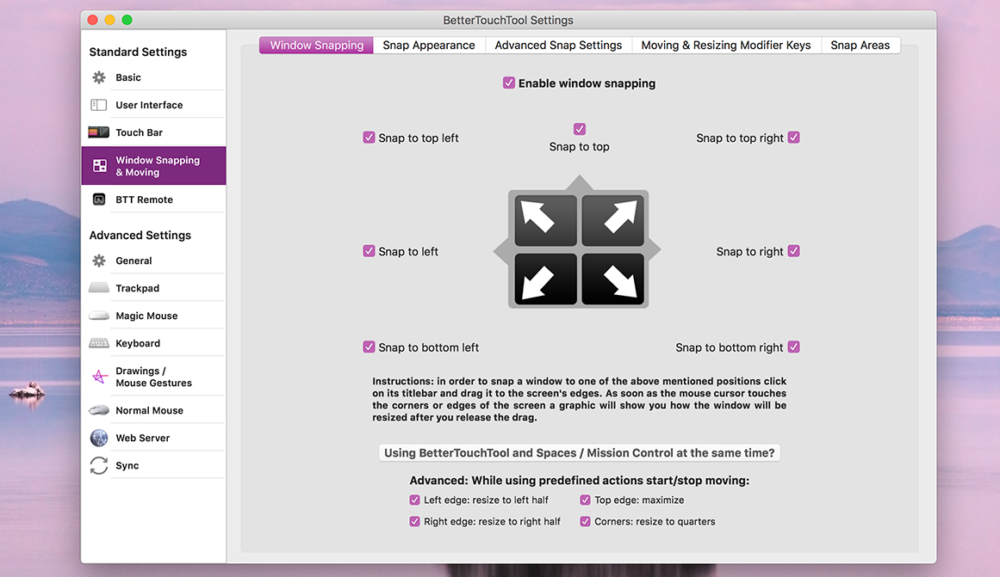

# Window Snapping

Window snapping is a very powerful feature in BetterTouchTool. It allows you to easily arrange windows on your Mac by, for example, using your mouse, trackpad gestures, or keyboard shortcuts. For a quick introduction, watch the video below:

<video width="100%" controls style="margin-bottom:20px; max-width:1200px">
  <source src="media/windowsnapping.mp4" type="video/mp4">
Oops, your browser does not support the playback of this video.
</video>

# Basic Window Snapping Setup
Window snapping is enabled by default, however you can customize many things in the settings:

On how to access the settings see [Settings](./docs/5_settings.md)

# Basic Usage

Using window snapping is quite easy. Simply drag the window you want to snap to the side of the screen you want to snap it to. For example, if you want to make the current window take up the left half of the screen, drag the window to the left edge of the screen until your cursor touches the left edge. When you see the expanding box, you can let release the window to make it fill up on the left side.

If you want to restore the window to its original size, just drag the window away from the snapped position and it will be resized automatically.

There are a number of different areas where you can drag windows to:

* The left/right side of the screen to make the window take up the left/right half
* Any of the four corners of the screen to make the window take up a quarter of the screen in that corner
* The top of the screen, which will maximize the window
