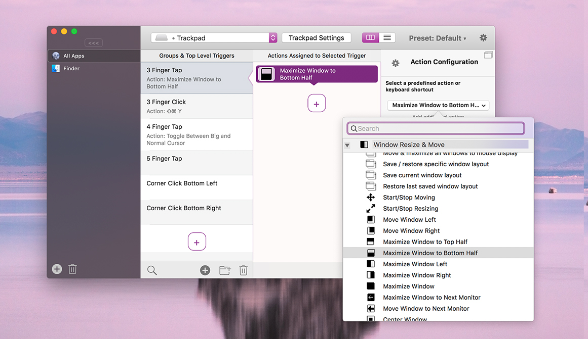

# Snap using Triggers

BetterTouchTool offers an extensive set of actions that allow you to move & resize windows. By assigning these actions to some custom triggers (e.g. keyboard shortcuts or trackpad gestures) you can create nice workflows easily.

In case the default sizes / positions don't work for you, these is also a predefined action called **Custom Move/Resize**, which allows you to resize and move windows to completely customizable positions.
