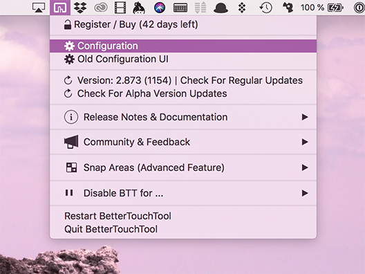
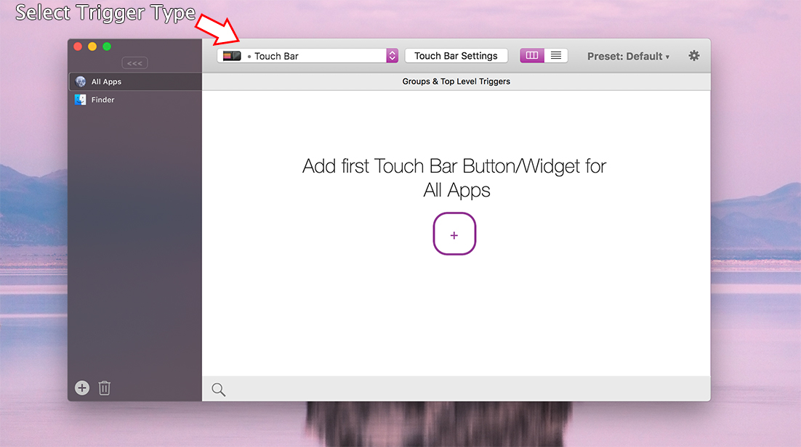
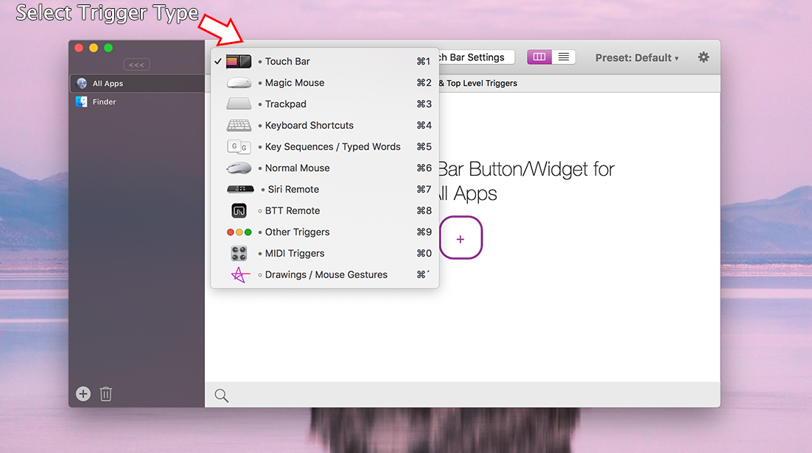

##Installation
**Installing BetterTouchTool is easy.**

1. Download BetterTouchTool from https://folivora.ai/downloads/
2. Unzip the downloaded zip file (please use the Apple default unarchiver tool, others may cause issues)
3. Move the unpacked BetterTouchTool.app to your applications folder
4. **Done!** You can now double-click to start BetterTouchTool
5. Continue with the initial setup to get BetterTouchTool up and running.

## Uninstall
If you ever need to uninstall BetterTouchTool, just delete its app file from your Applications folder (or the folder you put it after downloading & unzipping it).

If you also want to get rid of BetterTouchTool's settings files (usually only a few KB, thus that's not really necessary), delete:

1. ~/Library/Application Support/BetterTouchTool
2. ~/Library/Preferences/com.hegenberg.BetterTouchTool.plist

## Buy License
You can use the BetterTouchTool trial version for 45 days without limitation. Afterwards you need to buy a license. For more information please see [https://folivora.ai/buy/]()

## Activate License
Activating your new BetterTouchTool license is very easy.

After your purchase via my reseller paddle.com you have received an e-mail with the title "BetterTouchTool License For ***" (where *** is the name you provided).

This e-mail contains an activation link you can click to automatically install and activate your new license. Alternatively it has a license file attached, which you can download & double-click in order to activate BetterTouchTool

If you can not find the license e-mail, first make sure to check you spam folder. If that doesn't help, you may have had a typo in your e-mail address or some other problem with your e-mail account, in that case you will need to contact me via andreas@folivora.ai.

## Lost License
If you have lost your license file try these steps:

1. Search your e-mails for this subject: **BetterTouchTool License For**

2. If your purchased your license before 2018 search for **Personal BetterTouchTool License**. In that case your download link will be expired, you can however recover your license via https://lostlicense.boastr.net

3. You can contact me via andreas@folivora.ai, please include all information you still remember (e.g. the e-mail and name used for the purchase). In case I'm unresponsive (e.g. due to vacation, you can also contact my reseller directly)

## Initial Setup
After starting BetterTouchTool for the first time you may see this message popup quite often:

**"BetterTouchTool" would like to control this computer using accessibility features** 
Grant access to this application in Security & Privacy preferences, located in System Preferences.:

This message pops up because BetterTouchTool uses an API called "Accessibility API". That API is necessary for many of BetterTouchTool's core functions. It is therefore required to enabled it if you want to continue using BetterTouchTool.

The Accessibility API was made for accessibility tools like screen readers or other tools that may help people with disabilities to use their computers. This is why it offers some functionality that is normally not available to apps. For example the whole window snapping features in BetterTouchTool are only possible because of the accessibility API.

Normal applications only have access to their own windows, controls etc..  Only by using the Accessibility API we get access to other apps and can control them. This is both very powerful but also dangerous because malicious applications could use this for bad things. This is why Apple shows the above warning message for any app that wants to use the API.

To allow BetterTouchTool to use the Accessibility API go to System Preferences => Security & Privacy => Privacy => Accessibility, see:

## Configuring your first Trigger
Before adding your first gesture or shortcut, you need to open the BetterTouchTool preferences window. It is accessible via the menubar icon.

After you have opened the configuration window, you will see something like this. First choose the trigger type you want:

Afterwards just click the big plus button to add your first Trigger.

