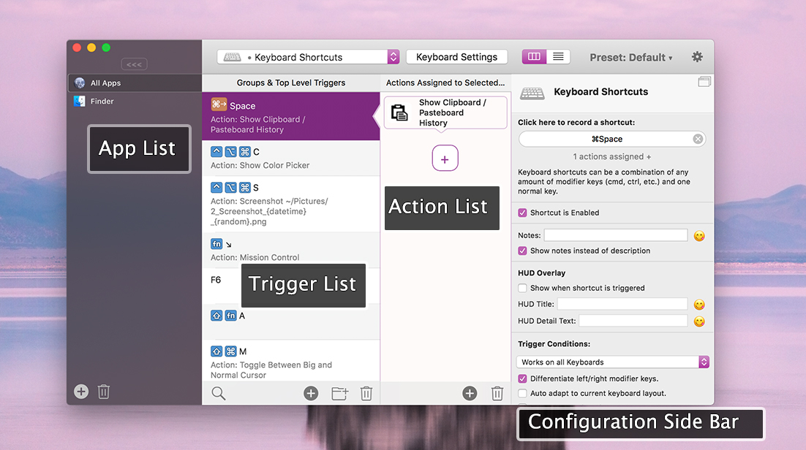

#Basic Preferences Overview
This section wants to give you an overview of the BetterTouchTool configuration. The window you see in the screenshot below is where you can configure almost every feature available in BetterTouchTool (and there are many 😉)

Let's dive into the different parts of that window:

## App List
Actions in BetterTouchTool can either be assigned to a specific application or globally to all apps. 
By default BetterTouchTool has two items in the App List: *All Apps* and *Finder*.

You can easily add as many other applications as you want. To do this click the ➕ button on the bottom left of the list (or alternatively drag an app directly onto the list from Finder). To delete an application press the trash button. 

**Pressing the trash button will delete the application and all gestures / triggers you have associated with it.**

## Trigger List

BetterTouchTool allows you to configure actions for many types of Triggers.

You can choose between: 
* **Touch Bar**: Add all kind of different widgets and buttons to completely customize your Touch Bar
* **BTT Remote**: Here you can configure the companion App BTT Remote (which is free for everybody who bought BetterTouchTool)
* **Magic Mouse**: Configure gestures for the Magic Mouse 1 & 2
* **Trackpad**: Configure gestures for any multitouch capable Apple Trackpad currently on the market (The various Macbook's built-in trackpads, the Magic Trackpad 1 & 2)
* **Keyboard**: Configure keyboard shortcuts
* **Drawings**: Configure custom drawing gestures.
* **Normal Mice**: Reconfigure your normal mouse buttons.
* **Siri Remote**: Configure gestures & buttons on the new Siri Remote that comes with the new Apple TV
* **Other**: Contains all triggers that do not fit into any other category.

## Action List

The action list shows all actions that are assigned to the selected Trigger. They will all be triggered in sequence if the Trigger is activated, so you can easily chain multiple actions.

Actions can be keyboard shortcuts, scripts or any of the predefined actions available in BetterTouchTool

## Configuration Side Bar

The Configuration Side Bar on the right side of the window is used for almost all configuration tasks in BetterTouchTool. 

It adapts to the selected item, if you select a Trigger from the list of Triggers, it will show the configuration options available for that. If you select a action or even an app it will show the configuration options for these.

In this example a Touch Bar button Trigger is selected, which comes with many configuration options like background color, title, icons etc.:

If you want you can undock the side-bar by pressing the undock icon on the top right.
