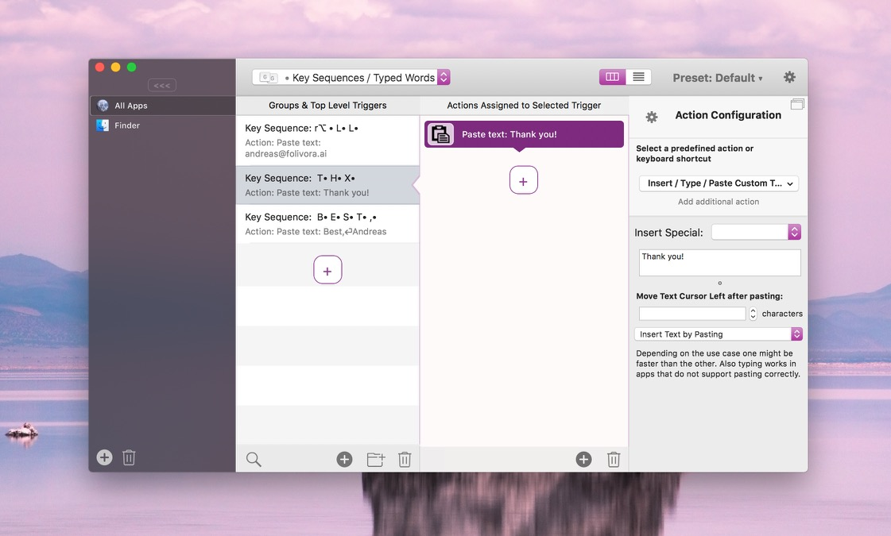
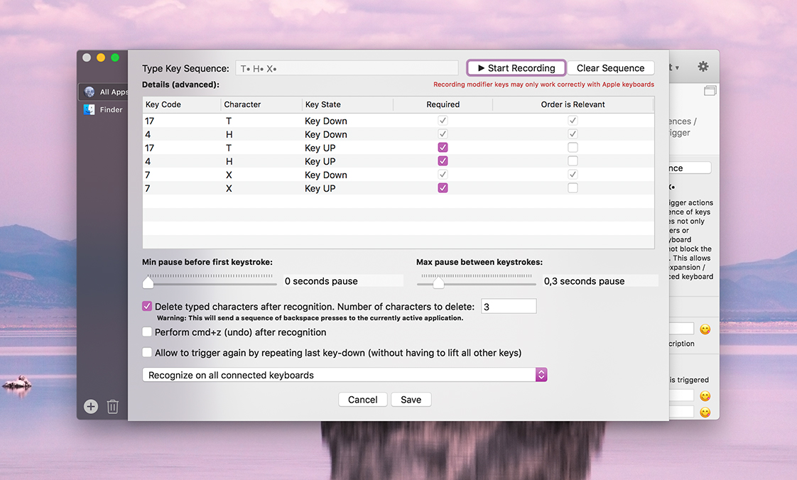

# Key Sequences

Key Sequences are a powerful new feature. A Key Sequence can be any sequence of key presses, e.g. a typed word or a sequence of modifier keys and keys.

In contrast to keyboard shortcus, Key Sequences will not block the keys from reaching the app - instead you can choose to delete/undo the typing after a specific sequence has triggered an action.

A good way to use Key Sequences is in combination with the **Insert/Type/Paste Custom Text** action. By doing this you can use them to expand text snippets.

For example:
* Key Sequences allow you to trigger any BTT actions by typing words
* Key Sequences allow you to trigger actions by only pressing modifier keys
* Key Sequences allow you to trigger actions by pressing one or more keys multiple times in sequence
* You can use Key Sequences to expaned typed text by combining them with the "Paste Custom Text" predefined action
* Key Sequences do *not* block the input events generated by the pressed characters. However you can make them delete any typed text directly after triggering the action.

