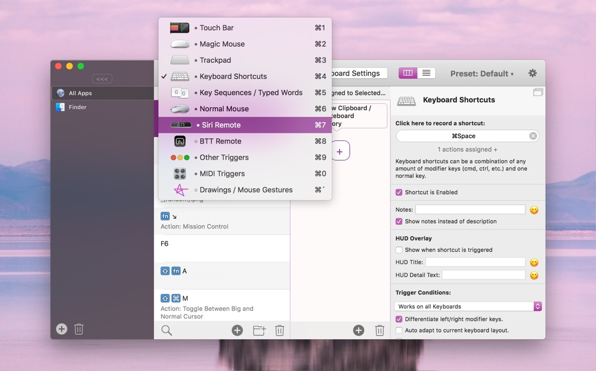
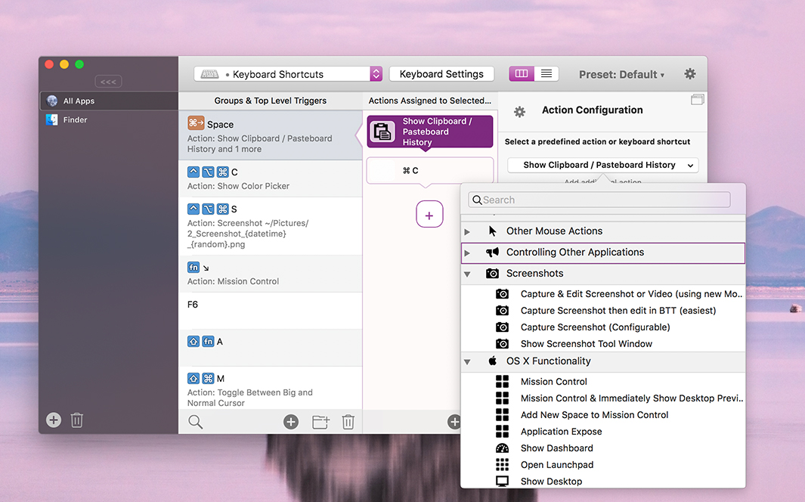

# Adding a new Trigger

BetterTouchTool allows you to configure actions for all kind of triggers. To do that you first need to choose the trigger type you like and add a new trigger of that type.

This is very easy.

## Step 1: Select the Trigger Type
You can choose the trigger type from the drop down menu in the top bar:

## Step 2: Press the + Button
The plus button in the list will insert a new trigger at the bottom of the list. The plus button in the bottom toolbar will insert a new trigger at the currently selected position in the list.

## Step 3: Configure the Trigger:
Now you need to configure the trigger. For most trigger types a popover will show up that lets you select the specific type you want to add. For example what kind of Trackpad or Magic Mouse gesture, or what kind of Touch Bar widget:

After choosing the type the configuration side bar will show all available configuration options:

## Step 4: Assign one or multiple Actions
A trigger doesn't do much if you do not assign any actions to it. So that's pretty much the most important step. 

So just press the plus button in the Action List, select the action type (e.g. a keyboard shortcut to send or one of the predfined actions to execute):

# Step 5: Test your Trigger
Now your trigger has everything it needs. You can try to trigger it now and see whether the assigned actions are executed as expected.

In case you encounter any issues it's often helpful to assign a "fail save" action like Mission Control to see whether the trigger works.
