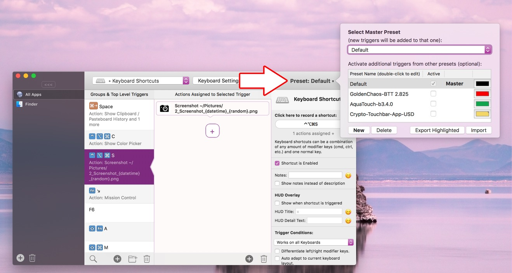

# Presets
The preset functionality in BetterTouchTool allows you to save or restore your complete gesture/shortcut configuration to/from a single file and thus easily switch between different setups.

It also allows you to share your setup with other people or use existing configurations shared by other users. There are some great ready to use presets available via https://community.folivora.ai

## Accessing the Preset functionality

The preset configuration can be accessed by pressing the Preset button on the top right:
 

### The Master Preset
Using the top dropdown in the preset view, you can choose the Master Preset. The Master Preset is important because:

* All new triggers you create are added to the Master Preset
* All app specific settings are saved to the Master Preset
* All app specific settings are loaded from the Master Preset (if conflicting ones are found in other presets, the Master Preset will take precedence)

Non-master presets that are enabled, will still work fine but if you want to add new triggers to them, make sure to set them as master first.

### Preset Standard functionality:
* **Create a new Preset**: By default BetterTouchTool comes with one standard preset. You can however add as many other presets as you want, e.g. for different situations.
* **Enable / Disable Preset**: Presets can be disabled or enabled at any time. For example you can have a preset for work and one for home and easily switch between them.
* **Delete a Preset**: Presets can be deleted at any time.
* **Export a Preset**: Allows you to export the selected preset in a JSON format to share with others or for backup purposes.
* **Import a Preset**: You can import presets you have exported previously or presets from other users. However be aware that presets can contain all kind of scripts that could execute malicious things. **Only import presets from people you trust!**

## Switching between Presets
The most common way to switch between different presets is to enable/disable them as described above. Howver there are also predefined actions that allow you to activate specific presets. This can be quite useful, e.g. you can enable/disable specific presets using a keyboard shortcut.

The predefined actions are:
* **Switch to Preset / Enable specific Preset**

This allows you to exactly specify which presets shall become active after the action has been executed. It also allows you to specify which preset will become the new Master Preset.

* **Toggle Preset Enabled/Disabled**

This action allows you to toggle the enabled/disabled state of the selected presets.
