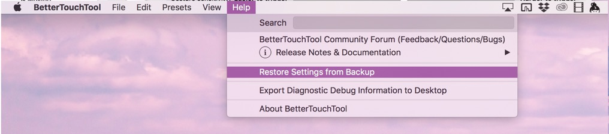

# Restoring Automatic Backups

There can be many reasons why you want to restore a backup of your BetterTouchTool settings. For example your current settings may have gotten corrupted for some reason (e.g. a hard drive or software issue), or you accidentall deleted some things you need back.

BetterTouchTool creates a backup of your settings everytime after it updates to a new version. 
These backups are located in ```~/Library/Application Support/BetterTouchTool```. To open this folder, go to Finder, then click "Go" and then click "Go To Folder". There you can enter the path to this folder (make sure to include the ~).


The easiest way to restore a backup is t o use the BetterTouchTool menubar menu

 **Help => Restore Settings From Backup**


This will show a list of all backups that are available including their last modification dates. Just try to use one of them that sounds reasonable to you.
