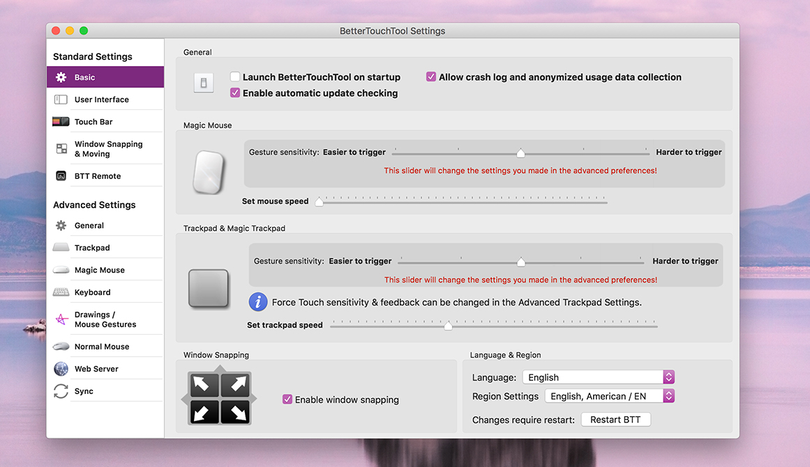

# Other BetterTouchTool Settings

BetterTouchTool is very customizable and offers tons of settings. Most settings have default values that should work for the majority of users.

There are three different ways to access the settings:

1. Use the menubar menu, BetterTouchTool => Preferences

2. If the selected trigger type has specific settings, it will show a button that allows you to access them directly (in the screenshot above "Keyboard Settings")

3. Press the little gear icon on the top right

All of these options will open the BetterTouchTool settings window:

I won't describe all the settings here. Just note that the settings are separated into "Standard Settings" and "Advanced Settings". In general you should not need the advanced settings very often.

