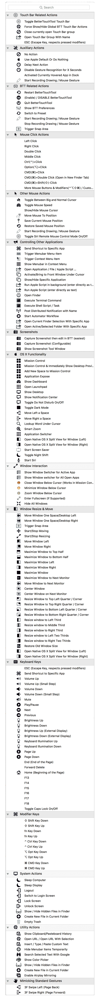

# (Predefined) Actions

Actions are probably the most important part of BTT. You can assign one or multiple actions to any trigger configured in BTT and they will be executed in sequence as soon as the trigger is activated.

There are MANY actions available in BTT. The following list shows some of them, but is not up-to date. 

