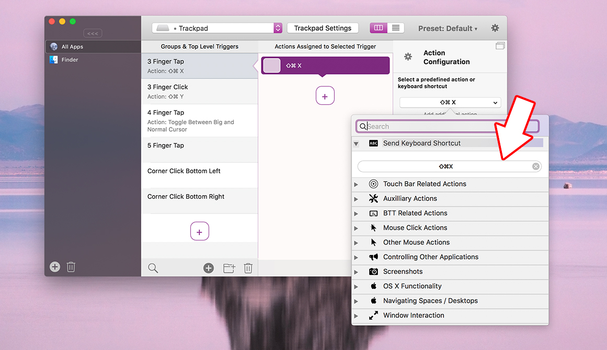
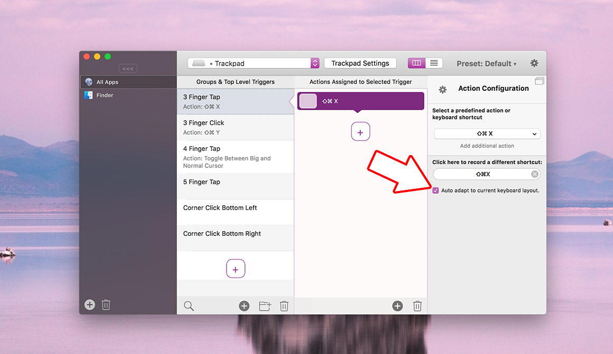
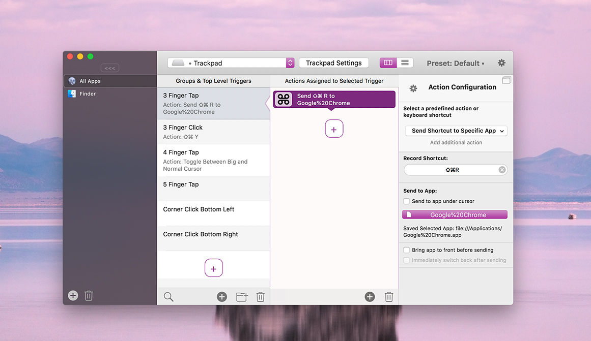

# Sending Keyboard Shortcuts to Other Applications

BetterTouchTool allows you to send any kind of keyboard shortcut to the system. The easiest way to do this is to just open the list of actions, go to the "Send Keyboard Shortcut" section and record a new shortcut.

When doing this, BTT will simulate this shortcut as if you'd press it on a real keyboard. This means it will be sent to whichever is the active app at that time.

### Changing Keyboard Layouts
In case you are working with different keyboard layouts, BTT offers two options. By default BTT will save the physical location of the keys on the keyboard, however this means that the meaning of the shortcut may change when changing keyboard layouts.

To prevent this you can activate the "Auto adapt to current keyboard layout" option. This option has only recently been added - if you want to enable it for existing shortcuts you will need to re-record them.

## Sending Shortcuts to Specific Applications
One more thing that BTT can do is sending keyboard shortcuts to specific applications. This can be useful if the application you want to control is currently not the active one. (e.g. if you want to pause an iTunes track, but iTunes is not active)

This can be done using the predefined action **Send Shortcut to Specific App**

This action will try to directly access the application and simulate the shortcut. In some cases this may not be possible - then you can choose to temporarily bring the selected app to front, send the shortcut and immediately switch back to the previously active application.

