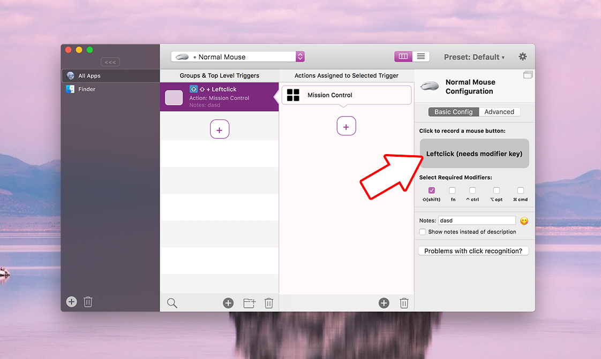

# Assigning actions to your various mouse buttons

With BetterTouchTool it's quite easy to configure actions for your mouse buttons.

Just select the "Normal Mouse" trigger type, press the + button and then record the specific mouse button by clicking the grey area in the side-bar on the right:

Left and right-clicks can currently only trigger actions if they have at least one modifier key enabled.
