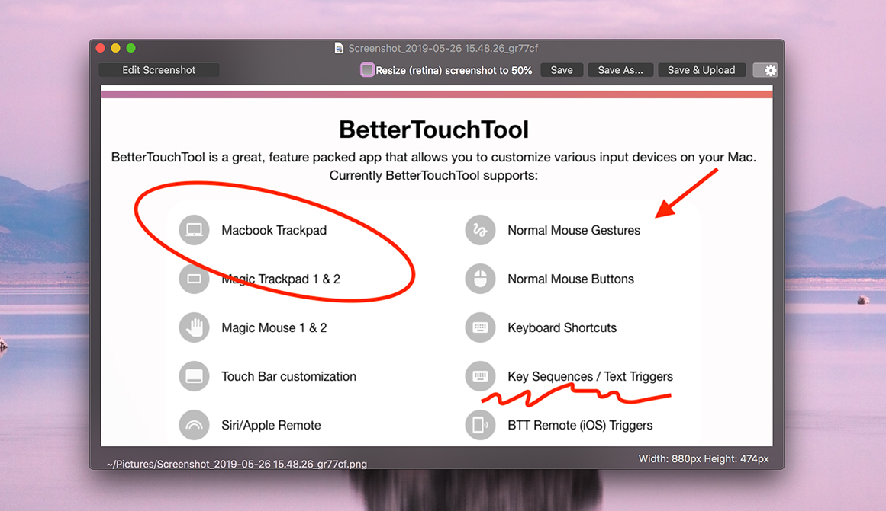
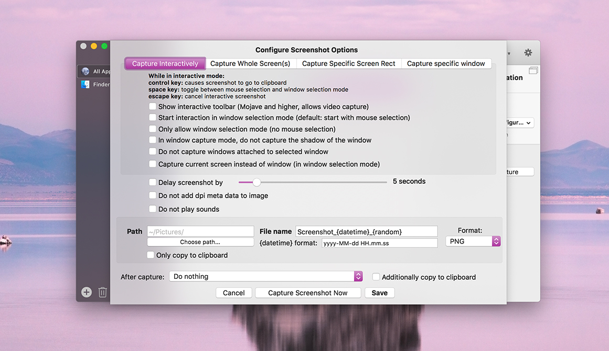

# Screenshots

BetterTouchTool offers multiple actions to capture screenshots:

## Capture Screenshot then edit in BTT (easiest)
This is my favorite action because it allows you to easily edit a screenshot after capturing it.

It starts the default macOS screenshot utility (where you can switch between free selection and window selection by pressing the space key). After you have captured the screenshot it will allow you to edit and save the screenshot:

## Capture & Edit Screenshot or Video (Using default macOS tools)

This will launch the default macOS screenshot / video capture utility.

## Capture Screenshot (configurable)

This allows  you to fully customize how you'd like to take a screenshot. This includes advanced options like delays, file formats, specific sizes etc.

